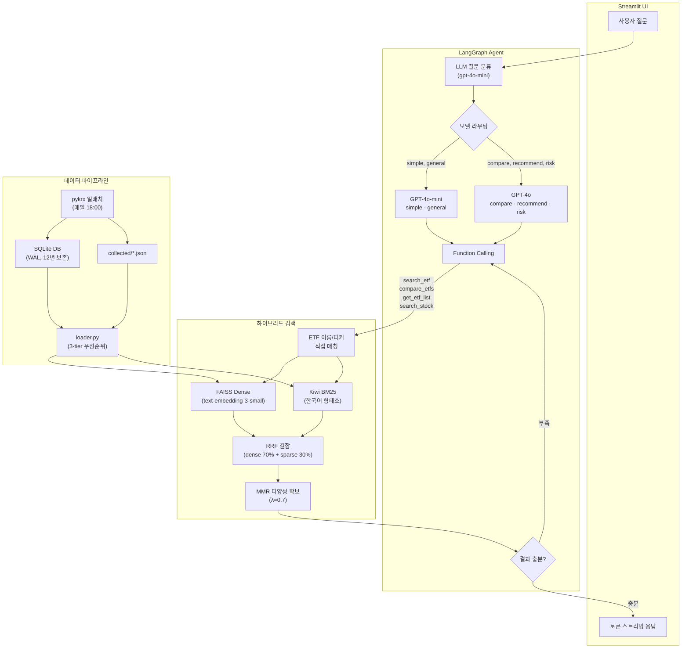

# 투자 질의응답 챗봇 (ETF + 주식)

> KRX 전종목 실시간 데이터 기반 하이브리드 검색 + LangGraph 에이전트 금융 질의응답 시스템

[](https://aiagent-5ejryv4fsnjvhrevzwn3ct.streamlit.app/)
[](#)
[](#)
[](#)

---

## ChatGPT와 다른 점

| | ChatGPT | 이 프로젝트 |
|---|---------|------------|
| **데이터** | 학습 데이터 기준 (수개월 전) | **오늘의** NAV, 수익률, 거래량 (일배치 수집) |
| **종목 수** | 학습된 일부만 | KRX ETF **~1,088개** + 주식 전종목 **~3,100개** |
| **검색** | 없음 (기억에 의존) | FAISS + BM25 하이브리드 + MMR |
| **출처** | 없음 | 검색된 ETF/주식 명시 (티커, 관련도) |
| **비교 분석** | 일반적 답변 | 실데이터 기반 종목 비교 |
| **비용** | $20/월 | **~$5/월** (모델 라우팅으로 최적화) |

---

## 핵심 기능

### LangGraph 에이전트 + Function Calling
- LLM이 질문을 분석하고 적절한 도구를 **자동 선택** (11개 도구: 검색, 비교, 기술적 분석, 상관관계, 포트폴리오 시뮬레이션 등)
- 검색 결과 부족 시 **자동 재검색** (Conditional Edge, 최대 2회)
- 토큰 단위 실시간 스트리밍 응답

### 모델 라우팅 (비용 최적화)
- 단순 질문 (가격, 수익률 조회) → **GPT-4o-mini** (빠르고 저렴)
- 복잡 질문 (비교 분석, 추천, 위험) → **GPT-4o** (정확도 우선)

### 하이브리드 검색
- **FAISS** (OpenAI `text-embedding-3-small`) + **Kiwi BM25** (한국어 형태소 분석)
- **RRF** (Reciprocal Rank Fusion) 결합 — dense 70% + sparse 30%
- **MMR** (Maximal Marginal Relevance) — Jaccard 유사도 기반 다양성 확보
- **ETF 이름/티커 직접 매칭** — 정확도 우선 pre-filter

### 데이터 파이프라인
- **pykrx** 기반 일배치 수집 (ETF ~1,088종목 + 주식 KOSPI/KOSDAQ ~3,100종목)
- 시세(OHLCV), NAV, 수익률(1일~1년), 보유종목, 괴리율, 추적오차, PER/PBR/EPS/BPS/DPS
- **SQLite** 12년 보존 (WAL 모드, 800만 행, 1.5GB) + JSON 듀얼 라이트
- macOS launchd 매일 18:00 자동 수집

### 정량 분석 도구
- **기술적 지표**: MA(5/20/60/120), RSI, MACD, 볼린저 밴드, 골든/데드크로스
- **상관관계/베타**: 종목 간 상관계수, 시장 대비 베타 계수
- **포트폴리오 시뮬레이션**: 백테스트, MDD, 샤프 비율, 연환산 수익률

### 정량 평가 (RAGAS)
- 124개 평가 데이터셋 (8개 유형: simple, compare, recommend, risk, general, technical, correlation, portfolio)
- **전체 Hit Rate 91.9%** — ETF 88%, 주식 100%, 혼합 100%

---

## 아키텍처



---

## 기술 스택

| 구분 | 기술 |
|------|------|
| **에이전트** | LangGraph + Function Calling (11개 도구) |
| **LLM** | GPT-4o / GPT-4o-mini (질문 유형별 라우팅) |
| **검색** | FAISS + Kiwi BM25 + RRF + MMR |
| **임베딩** | OpenAI text-embedding-3-small |
| **데이터** | pykrx (ETF ~1,088 + 주식 ~3,100), SQLite 12년 (800만 행) |
| **분석** | 기술적 지표 (MA/RSI/MACD/볼린저), 상관관계/베타, 포트폴리오 시뮬레이션 |
| **한국어** | Kiwi 형태소 분석기 (BM25 토크나이저) |
| **평가** | RAGAS (124개 데이터셋, Hit Rate 91.9%) |
| **모니터링** | LangSmith (무료 5,000 traces/월) |
| **배포** | Streamlit Cloud |
| **테스트** | pytest 279개 |

---

## 설치 및 실행

### 1. 클론 및 패키지 설치

```bash
git clone https://github.com/m2222n/AI_agent.git
cd AI_agent/ETF_RAG

python -m venv .venv
source .venv/bin/activate
pip install -r requirements.txt
```

### 2. 환경 변수 설정

```bash
cp .env.example .env
# .env 파일에 OPENAI_API_KEY 설정
```

### 3. 실행

```bash
streamlit run app.py
```

브라우저에서 `http://localhost:8501` 접속

### 4. 테스트

```bash
pytest tests/ -q
```

---

## 프로젝트 구조

```
ETF_RAG/
├── app.py                      # Streamlit 진입점
├── config.py                   # 설정/경로/상수 관리
├── requirements.txt
├── .env.example
│
├── src/
│   ├── data/
│   │   ├── loader.py           # 데이터 로드 (SQLite → JSON → 하드코딩 fallback)
│   │   ├── database.py         # SQLite CRUD (6 테이블, WAL 모드, 12년 보존)
│   │   ├── collector.py        # pykrx ETF 일배치 수집
│   │   ├── stock_collector.py  # pykrx 주식 일배치 수집
│   │   ├── technical.py        # 기술적 지표 (MA/RSI/MACD/볼린저/상관계수/베타)
│   │   ├── realtime.py         # yfinance 장중 시세 (15분 지연)
│   │   └── pdf_loader.py       # PDF 파싱 + 청킹 파이프라인
│   ├── rag/
│   │   ├── retriever.py        # HybridRetriever (FAISS+BM25+RRF+MMR)
│   │   └── vectorstore.py      # FAISS 인덱스 생성
│   ├── llm/
│   │   ├── agent.py            # LangGraph 에이전트 (라우팅+도구+재검색)
│   │   ├── tools.py            # Function Calling 도구 11개
│   │   ├── prompts.py          # 질문 유형별 시스템 프롬프트
│   │   └── classifier.py       # LLM 분류 fallback (키워드 기반)
│   └── ui/
│       ├── chat.py             # 질문 처리 + 스트리밍 UI
│       ├── sidebar.py          # 사이드바 (ETF/주식 목록)
│       └── components.py       # 예시 질문, 피드백 버튼
│
├── eval/
│   ├── eval_dataset.json       # RAGAS 평가 데이터셋 (124개, 8개 유형)
│   ├── run_eval.py             # 평가 실행 스크립트
│   └── results/                # 평가 결과 JSON
│
├── tests/                      # pytest 279개
├── scripts/
│   ├── daily_collect.sh        # 일배치 수집 스크립트
│   └── com.etfrag.daily-collect.plist  # macOS launchd 스케줄
└── docs/
```

---

## 검색 파이프라인 상세

```
사용자 질문: "KODEX 200이랑 TIGER S&P500 비교해줘"

1. LLM 분류 → "compare" → GPT-4o 선택
2. Function Calling → compare_etfs("KODEX 200", "TIGER 미국S&P500")
3. 각 ETF 개별 검색:
   a. ETF 이름 직접 매칭 → "KODEX 200" 문서 즉시 반환 (score=1.0)
   b. "TIGER 미국S&P500" → 직접 매칭 → 즉시 반환
4. 두 ETF 데이터 병합 → LLM에 전달
5. GPT-4o가 구조화된 비교 답변 생성 → 토큰 스트리밍
```

---

## 평가 결과

| 유형 | Hit Rate | 질문 수 |
|------|----------|---------|
| simple | 93.3% | 32 |
| compare | 90.0% | 13 |
| recommend | 92.9% | 18 |
| technical | — | 18 |
| general | 83.3% | 14 |
| correlation | — | 12 |
| portfolio | — | 12 |
| risk | 80.0% | 5 |
| **전체** | **91.9%** | **124** |

> ETF 이름 매칭 도입으로 Hit Rate 45% → 88% (+43%p) 개선
> 주식 + 정량 분석 도구 확장 후 전체 91.9% 달성 (124개 데이터셋)

---

## 비용 분석

| 항목 | 월 예상 비용 |
|------|------------|
| OpenAI API (라우팅 적용) | $3~12 |
| Streamlit Cloud | 무료 |
| LangSmith | 무료 (5,000 traces) |
| **합계** | **~$5~15/월** |

> 모델 라우팅으로 단순 질문의 70%를 GPT-4o-mini로 처리 → API 비용 ~60% 절감

---

## 로드맵

- [x] Phase 0: 프로젝트 구조 리셋 (단일 파일 741줄 → 모듈 분리)
- [x] Phase 1: pykrx 데이터 수집 + SQLite + 일배치 자동화
- [x] Phase 2: 하이브리드 검색 (FAISS+BM25+RRF+MMR) + RAGAS 평가
- [x] Phase 3: LangGraph 에이전트 + 모델 라우팅 + 토큰 스트리밍
- [x] Phase 4: UI/UX 개편, 비교 차트, 실시간 시세 연동
- [x] Phase A~B: 주식 전종목 확장 + 주식 서비스 MVP
- [x] Phase C: 정량 분석 (기술적 지표, 상관관계/베타, 포트폴리오 시뮬레이션)
- [ ] Phase D: 예측 모델 (LSTM/Transformer, 감성 분석)

---

## 면책 조항

본 서비스는 정보 제공 목적이며, 투자 권유가 아닙니다. 투자 결정은 본인의 판단과 책임 하에 이루어져야 합니다.
