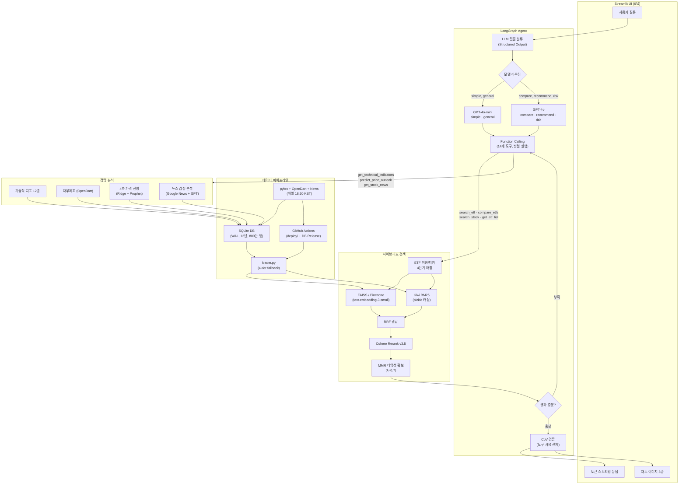

# 투자 질의응답 챗봇 (ETF + 주식)

### **[라이브 데모 바로가기](https://aiagent-5ejryv4fsnjvhrevzwn3ct.streamlit.app/)** — 별도 설치 없이 브라우저에서 바로 사용 가능

> KRX 전종목 실시간 데이터 기반 하이브리드 검색 + LangGraph 에이전트 금융 질의응답 시스템

[](https://aiagent-5ejryv4fsnjvhrevzwn3ct.streamlit.app/)
[](#)
[](https://github.com/m2222n/AI_agent/actions/workflows/ci.yml)
[](#)
[](#)
[](#)

---

## 왜 만들었나?

범용 AI 챗봇에 "삼성전자 지금 사도 될까?"라고 물으면 학습 데이터 기준의 일반적인 답변이 돌아옵니다. **오늘의 시세, 실제 재무제표, 기술적 지표를 근거로 한 분석**은 불가능합니다.

이 프로젝트는 그 간극을 메웁니다:

- **실시간 데이터**: 매일 18:30 자동 수집 — 오늘의 종가, 거래량, NAV가 반영된 답변
- **KRX 전종목 커버**: ETF ~1,088개 + 주식 ~3,100개, 12년치 이력 데이터
- **정량 분석**: 기술적 지표 12종 + 재무제표 + 4축 가격 전망 모델 + 뉴스 감성 분석
- **검증된 답변**: CoV (Chain of Verification)로 도구 결과 vs 답변 자동 교차 검증
- **차트 자동 생성**: 기술적 분석, 재무 실적, 포트폴리오 시뮬레이션 등 8종
- **월 ~$5**: 모델 라우팅으로 단순 질문은 GPT-4o-mini, 복잡 분석만 GPT-4o

---

## 핵심 기능

### LangGraph 에이전트 + Function Calling
- LLM이 질문을 분석하고 적절한 도구를 **자동 선택** (14개 도구)
- **멀티 도구 병렬 호출** — ThreadPoolExecutor로 2개+ 도구 동시 실행 (응답 시간 ~50% 단축)
- 검색 결과 부족 시 **자동 재검색** (Conditional Edge, 최대 2회)
- **CoV (Chain of Verification)** — 도구 사용 질문 전체 대상 검증 (general 제외)
- **Structured Output** — Pydantic 스키마로 LLM 분류 JSON 강제
- 토큰 단위 실시간 스트리밍 응답

### 14개 Function Calling 도구

| 도구 | 기능 |
|------|------|
| `search_etf` | ETF 하이브리드 RAG 검색 |
| `search_stock` | 주식 RAG 검색 |
| `compare_etfs` | ETF 비교 분석 (개별 검색 후 병합) |
| `compare_stocks` | 주식 비교 분석 (PER/PBR/시총/배당) |
| `get_etf_list` | 카테고리별 ETF 목록 |
| `get_stock_list` | 주식 카테고리별 목록 |
| `get_realtime_price` | 장중 실시간 시세 (yfinance, 15분 지연) |
| `get_technical_indicators` | 기술적 지표 12종 + 3단 차트 이미지 |
| `get_stock_correlation` | 종목 간 상관계수 + 베타 계수 |
| `simulate_portfolio` | 포트폴리오 백테스트 (MDD/샤프/벤치마크) |
| `get_financial_statements` | 분기별 재무제표 (OpenDart) |
| `predict_price_outlook` | 4축 가격 전망 (기술적+펀더멘털+Ridge+Prophet) |
| `get_stock_news` | 종목 뉴스 + GPT 감성 분석 |
| `analyze_sector` | 업종 분석 + 밸류에이션 위치 |

### 모델 라우팅 (비용 최적화)
- 단순 질문 (가격, 수익률 조회) → **GPT-4o-mini** (빠르고 저렴)
- 복잡 질문 (비교 분석, 추천, 위험) → **GPT-4o** (정확도 우선)

### 하이브리드 검색
- **FAISS** (OpenAI `text-embedding-3-small`, MD5 해시 디스크 캐싱) + **Kiwi BM25** (한국어 형태소 분석, pickle 캐싱)
- **Cohere Rerank v3.5** — cross-encoder 재정렬 (API 키 없으면 자동 비활성화)
- **RRF** (Reciprocal Rank Fusion) 결합 → Rerank → **MMR** (다양성 확보)
- **4단계 이름 매칭**: 정확 매칭 → 접두어 매칭 → 부분 키워드 매칭 → 한글 별칭 매핑
- **Pinecone 듀얼 백엔드**: FAISS/Pinecone 선택 가능 (`VECTOR_DB_BACKEND` 환경변수), 실패 시 FAISS 자동 fallback

### 데이터 파이프라인
- **pykrx** 기반 일배치 수집 (ETF ~1,088종목 + 주식 KOSPI/KOSDAQ ~3,100종목)
- 시세(OHLCV), NAV, 수익률(1일~1년), 보유종목, 괴리율, 추적오차, PER/PBR/EPS/BPS/DPS
- **OpenDart** 분기 재무제표 (매출/영업이익/순이익/마진/YoY 성장률, 전종목 백필 완료 147,048건) + 매주 월요일 자동 갱신
- **Google News RSS** — 종목별 최신 뉴스 수집 + GPT-4o-mini 감성 분석
- **SQLite** 12년 보존 (WAL 모드, 800만+ 행, 1.5GB) + JSON 듀얼 라이트
- **듀얼 자동 수집**: GitHub Actions (deploy/ JSON + SQLite DB Release → Streamlit Cloud 재배포) + macOS launchd (로컬 DB)
- **Watchdog 모니터링**: 수집 미실행 시 자동 재트리거 + GitHub Issue 알림
- **자동 검증/복구**: 최근 5영업일 누락 감지 + 자동 재수집

### 정량 분석
- **기술적 지표 12종**: MA(5/20/60/120), RSI, MACD, 볼린저 밴드, 골든/데드크로스, 스토캐스틱, 일목균형표, CCI, ADX, OBV, ATR
- **차트 이미지 8종**: 기술적 분석 3단 차트 / 비교 시계열 / 장중 시세 / 재무제표 실적 추이 / 밸류에이션 비교 / 포트폴리오 wealth curve+drawdown / 섹터 개요+상세
- **가격 전망 모델**: 4축 종합 분석 (기술적 스코어 + 펀더멘털 스코어 + Ridge 회귀 + Prophet 시계열), EMA 피처, Bootstrap CI(90%), 시나리오별 확률, 신뢰도 등급(A~D)
- **종합 판단**: 7개 지표 강세/약세 집계 → 자동 판정
- **실적 신호**: 4분기 트렌드 분석 (매출 가속/둔화/턴어라운드, 수익성 개선/악화)
- **상관관계/베타**: 종목 간 상관계수, 시장 대비 베타 (KODEX 200 벤치마크)
- **포트폴리오 시뮬레이션**: 백테스트, MDD, 샤프 비율, 연환산 수익률, 알파, 추적오차

### 평가 (RAGAS)
- **172개** 평가 데이터셋 (8개 유형: simple, compare, recommend, risk, general, technical, correlation, portfolio)
- **Hit Rate 100%** (172/172) — 4단계 이름 매칭 + eval 데이터셋 보정
- **답변 품질**: Faithfulness 0.688 / Answer Relevancy 0.709 / Context Recall 0.854

### UI/UX
- **6탭 분리**: 종합 채팅 / 기술적 분석 / 재무제표 / 가격 전망 / 비교 분석 / 섹터 분석
- 종목 자동완성 검색 (~4,200종목, 이름/티커 부분 매칭)
- 후속 질문 버튼 (도구 사용 기반 자동 제안)
- 동적 예시 질문 (급등/급락/거래대금 기반 실시간 생성)
- 관심종목(watchlist) 기능 (사이드바 ⭐ 토글)
- 응답 섹션 접기/펼치기 (st.expander)
- 모바일 반응형 CSS (768px 태블릿 + 480px 소형 폰 breakpoint)

---

## 아키텍처



---

## 기술 스택

| 구분 | 기술 |
|------|------|
| **에이전트** | LangGraph + Function Calling (14개 도구, 병렬 실행) + CoV 검증 + Structured Output |
| **LLM** | GPT-4o / GPT-4o-mini (질문 유형별 라우팅) |
| **검색** | FAISS (디스크 캐싱) + Kiwi BM25 (pickle 캐싱) + Cohere Rerank v3.5 + RRF + MMR |
| **Vector DB** | FAISS (기본) / Pinecone (듀얼 백엔드, 환경변수 선택) |
| **임베딩** | OpenAI text-embedding-3-small |
| **데이터** | pykrx (ETF ~1,088 + 주식 ~3,100) + OpenDart 재무제표 + Google News RSS, SQLite 12년 (800만+ 행) |
| **분석** | 기술적 지표 12종 + 4축 가격 전망 (Ridge+Prophet) + 포트폴리오 시뮬레이션 + 뉴스 감성 분석 |
| **차트** | matplotlib 8종 (기술적/비교/장중/재무/밸류에이션/포트폴리오/섹터, base64 PNG) |
| **한국어** | Kiwi 형태소 분석기 (BM25 토크나이저) |
| **평가** | RAGAS (172개 데이터셋, Hit Rate 100%, F=0.688, AR=0.709, CR=0.854) |
| **모니터링** | LangSmith (무료 5,000 traces/월) |
| **자동 수집** | GitHub Actions (deploy/ JSON + DB Release) + Watchdog (미실행 시 재트리거) + macOS launchd |
| **배포** | Streamlit Cloud (무료) |
| **테스트** | pytest 584개 |

---

## 설치 및 실행

### 1. 클론 및 패키지 설치

```bash
git clone https://github.com/m2222n/AI_agent.git
cd AI_agent/ETF_RAG

python -m venv .venv
source .venv/bin/activate
pip install -r requirements.txt
```

### 2. 환경 변수 설정

```bash
cp .env.example .env
```

| 변수 | 필수 | 설명 |
|------|------|------|
| `OPENAI_API_KEY` | **필수** | OpenAI API 키 |
| `DART_API_KEY` | 선택 | OpenDart 재무제표 수집 |
| `COHERE_API_KEY` | 선택 | Cohere Rerank (없으면 자동 비활성화) |
| `PINECONE_API_KEY` | 선택 | Pinecone 백엔드 (없으면 FAISS 사용) |
| `VECTOR_DB_BACKEND` | 선택 | `faiss` (기본) 또는 `pinecone` |
| `LANGCHAIN_API_KEY` | 선택 | LangSmith 트레이싱 |

### 3. 실행

```bash
streamlit run app.py
```

브라우저에서 `http://localhost:8501` 접속

### 4. 테스트

```bash
pytest tests/ -q
```

---

## 프로젝트 구조

```
ETF_RAG/
├── app.py                          # Streamlit 진입점
├── config.py                       # 설정/경로/상수 관리
├── requirements.txt                # Python 의존성 (25개)
├── packages.txt                    # Streamlit Cloud 시스템 패키지 (한글 폰트)
├── .env.example
│
├── src/
│   ├── data/
│   │   ├── loader.py               # 데이터 로드 (4-tier: SQLite → collected/ → deploy/ → 하드코딩)
│   │   ├── database/               # SQLite CRUD 패키지 (8 테이블, WAL 모드)
│   │   │   ├── _schema.py          #   스키마 정의, 커넥션 풀, 마이그레이션
│   │   │   ├── _write.py           #   ETF/주식 데이터 upsert
│   │   │   ├── _read.py            #   조회 (최신/이력/검색)
│   │   │   ├── _dart.py            #   DART 재무제표 CRUD
│   │   │   └── _maintenance.py     #   DB 유지보수 (prune, import, stats)
│   │   ├── technical/              # 기술적 지표 패키지 (12종)
│   │   │   ├── _data.py            #   DB 싱글턴, TTL 캐시, OHLCV 조회
│   │   │   ├── _indicators.py      #   MA/EMA/RSI/MACD/볼린저/크로스
│   │   │   ├── _advanced.py        #   스토캐스틱/일목균형표/CCI/ADX/OBV/ATR
│   │   │   ├── _portfolio.py       #   상관계수/베타/포트폴리오/벤치마크
│   │   │   └── _summary.py         #   통합 기술적 분석 요약
│   │   ├── chart_generator/        # matplotlib 차트 패키지 (8종)
│   │   │   ├── _style.py           #   한글 폰트, 컬러 팔레트
│   │   │   ├── _series.py          #   시계열 헬퍼, X축 라벨
│   │   │   ├── technical.py        #   기술적 분석/비교/장중 차트
│   │   │   ├── financial.py        #   재무제표/밸류에이션/포트폴리오 차트
│   │   │   └── sector.py           #   섹터 개요/상세 차트
│   │   ├── collector.py            # pykrx ETF 일배치 수집
│   │   ├── stock_collector.py      # pykrx 주식 일배치 수집 (KOSPI+KOSDAQ)
│   │   ├── dart_collector.py       # OpenDart 분기 재무제표 수집
│   │   ├── predictor.py            # 4축 가격 전망 모델 (Ridge+Prophet+EMA+Bootstrap CI)
│   │   ├── news.py                 # Google News RSS + GPT 감성 분석
│   │   ├── realtime.py             # yfinance 장중 시세 (15분 지연)
│   │   └── pdf_loader.py           # PDF 파싱 + 청킹 파이프라인
│   ├── rag/
│   │   ├── retriever.py            # HybridRetriever (FAISS+BM25+RRF+Cohere Rerank+MMR)
│   │   ├── vectorstore.py          # FAISS/Pinecone 듀얼 백엔드 (MD5 캐시)
│   │   └── utils.py                # 해시 계산 (FAISS/BM25 캐시 무효화)
│   ├── llm/
│   │   ├── agent.py                # LangGraph 에이전트 (라우팅+도구+재검색+CoV+병렬 실행)
│   │   ├── tools/                  # Function Calling 도구 패키지 (14개)
│   │   │   ├── _state.py           #   모듈 상태 (retriever, 인덱스)
│   │   │   ├── _helpers.py         #   종목 검색, enrichment 헬퍼
│   │   │   ├── _search.py          #   ETF/주식 검색, 비교, 목록 (6개)
│   │   │   ├── _analysis.py        #   시세, 섹터, 기술적 분석 (3개)
│   │   │   ├── _quantitative.py    #   상관관계, 포트폴리오, 재무제표 (3개)
│   │   │   └── _forecast.py        #   가격 전망, 뉴스 감성 (2개)
│   │   ├── prompts.py              # 질문 유형별 시스템 프롬프트 (6차 개선)
│   │   ├── classifier.py           # LLM 분류 fallback (키워드 기반)
│   │   └── client.py               # OpenAI 클라이언트
│   ├── ui/
│   │   ├── chat.py                 # 질문 처리 + 스트리밍 + 후속질문 콜백
│   │   ├── tabs.py                 # 6탭 UI (채팅/기술/재무/전망/비교/섹터)
│   │   ├── sidebar.py              # 사이드바 (ETF/주식 목록, 관심종목)
│   │   ├── charts.py               # 구조화 데이터 렌더링 (차트/테이블)
│   │   ├── components.py           # 예시 질문 (동적+기본), 피드백 버튼
│   │   └── styles.py               # 반응형 CSS (모바일 768px/480px)
│   └── utils/
│       ├── formatters.py           # 숫자/시총/거래대금 포맷터
│       └── logging.py              # 상호작용/피드백 로깅
│
├── eval/
│   ├── eval_dataset.json           # RAGAS 평가 데이터셋 (172개, 8개 유형)
│   ├── run_eval.py                 # 평가 실행 (--no-llm / full RAGAS)
│   └── results/                    # 평가 결과 JSON
│
├── tests/                          # pytest 584개 (26개 테스트 모듈)
│
├── scripts/
│   ├── collect_full.py             # GitHub Actions용 통합 수집 (deploy JSON + SQLite DB)
│   ├── collect_for_deploy.py       # 경량 수집 (deploy/ JSON 전용)
│   ├── daily_collect.sh            # 로컬 일배치 수집 (ETF+주식+DART+검증)
│   ├── verify_and_recover.py       # 수집 검증 + 누락 자동 보충
│   ├── backfill_historical.py      # 12년 과거 데이터 백필 (--resume)
│   ├── backfill_financials_runner.py # DART 재무제표 전종목 백필
│   ├── backfill_yfinance.py        # yfinance 보충 백필
│   ├── upload_db_to_release.sh     # 로컬 DB → GitHub Release 업로드
│   └── com.etfrag.daily-collect.plist # macOS launchd 스케줄
│
├── .gitignore                      # Python/SQLite/IDE/OS 파일 제외
├── .github/workflows/
│   ├── daily-collect.yml           # 자동 수집 (18:30 KST, 실패 시 Issue)
│   ├── ci.yml                      # CI (PR/push 시 pytest + coverage)
│   └── watchdog-collect.yml        # 수집 검증 (20:30 KST, 미실행 시 재트리거)
│
└── docs/
```

---

## 검색 파이프라인 상세

```
사용자 질문: "KODEX 200이랑 TIGER S&P500 비교해줘"

1. LLM 분류 (Structured Output) → "compare" → GPT-4o 선택
2. Function Calling → compare_etfs("KODEX 200", "TIGER 미국S&P500")
3. 각 ETF 개별 검색:
   a. 4단계 이름 매칭 → "KODEX 200" 즉시 반환 (score=1.0)
   b. "TIGER 미국S&P500" → 접두어 매칭 → 즉시 반환
4. (검색 경로일 경우) FAISS + BM25 → RRF → Cohere Rerank → MMR
5. 두 ETF 데이터 병합 → 구조화 데이터 enrichment → LLM 전달
6. CoV 검증 (도구 결과 vs 답변 교차 확인)
7. GPT-4o가 구조화된 비교 답변 생성 → 토큰 스트리밍
```

---

## 평가 결과

### 검색 품질 (Hit Rate)

| 유형 | Hit Rate | 질문 수 |
|------|----------|---------|
| simple | 100% | 38 |
| compare | 100% | 15 |
| recommend | 100% | 20 |
| technical | 100% | 45 |
| general | 100% | 15 |
| correlation | 100% | 12 |
| portfolio | 100% | 12 |
| risk | 100% | 5 |
| **전체** | **100%** | **172** |

> Hit Rate 개선 이력: 45% → 75% (이름 매칭) → 88% (에이전트) → 95.2% (프롬프트 개선) → **100%** (4단계 매칭 + eval 보정)

### 답변 품질 (RAGAS)

| 지표 | Baseline | 최종 (8차) | 개선폭 |
|------|----------|-----------|--------|
| **Faithfulness** | 0.500 | **0.688** | +0.188 |
| **Answer Relevancy** | 0.423 | **0.709** | +0.286 |
| **Context Recall** | 0.336 | **0.854** | +0.518 |

> 8차 개선: 컨텍스트 조립 강화 + 프롬프트 수치 인용 강제 + 한국어 역질문 프롬프트 + ground_truth 44개 보정

---

## 비용 분석

| 항목 | 월 예상 비용 |
|------|------------|
| OpenAI API (라우팅 적용) | $3~12 |
| Cohere Rerank (free trial) | 무료 |
| Pinecone (free tier) | 무료 |
| Streamlit Cloud | 무료 |
| LangSmith | 무료 (5,000 traces) |
| **합계** | **~$5~15/월** |

> 모델 라우팅으로 단순 질문의 70%를 GPT-4o-mini로 처리 → API 비용 ~60% 절감

---

## 로드맵

- [x] Phase 0: 프로젝트 구조 리셋 (단일 파일 741줄 → 모듈 분리)
- [x] Phase 1: pykrx 데이터 수집 + SQLite + 일배치 자동화 + 12년 백필
- [x] Phase 2: 하이브리드 검색 (FAISS+BM25+RRF+Cohere Rerank+MMR) + RAGAS 평가
- [x] Phase 3: LangGraph 에이전트 + 모델 라우팅 + CoV 검증 + Structured Output
- [x] Phase 4: 6탭 UI/UX, 비교 차트, yfinance 실시간 시세, 관심종목
- [x] Phase A~B: 주식 전종목 확장 (~3,100종목) + 주식 서비스 MVP
- [x] Phase C: 정량 분석 (기술적 지표, 상관관계/베타, 포트폴리오 시뮬레이션, 재무제표)
- [x] Phase D: 기술적 지표 확장 (12종) + matplotlib 차트 이미지 8종 + 예측 종합 응답
- [x] Phase E-1~3: 4축 가격 전망 (Prophet 추가), 뉴스 감성 분석, 섹터 탭, 속도 최적화
- [x] Phase E-4: Cohere Rerank, Pinecone 듀얼 백엔드, BM25 캐싱
- [x] 코드 리팩토링: 4개 대형 모듈 → 패키지 분리 (~4,170줄 → 22 서브모듈, 100% 역호환)
- [x] 코드 리뷰 6건 수정 + CI 파이프라인 (PR/push 자동 테스트) + .gitignore
- [x] Hit Rate 100% (172개 eval) + RAGAS 답변 품질 대폭 개선 (F=0.688, AR=0.709, CR=0.854)
- [ ] **Phase F: SaaS 전환** — FastAPI 백엔드 + React/Next.js 프론트엔드 + KIS 실시간 시세 + 로컬 감성 분석 (KoELECTRA)
- [ ] **Phase G: 모바일 앱** — React Native (웹 코드 70% 재사용), 푸시 알림, 오프라인 캐시

---

## 면책 조항

본 서비스는 정보 제공 목적이며, 투자 권유가 아닙니다. 투자 결정 시 추가 조사와 전문가 상담을 권장합니다.
