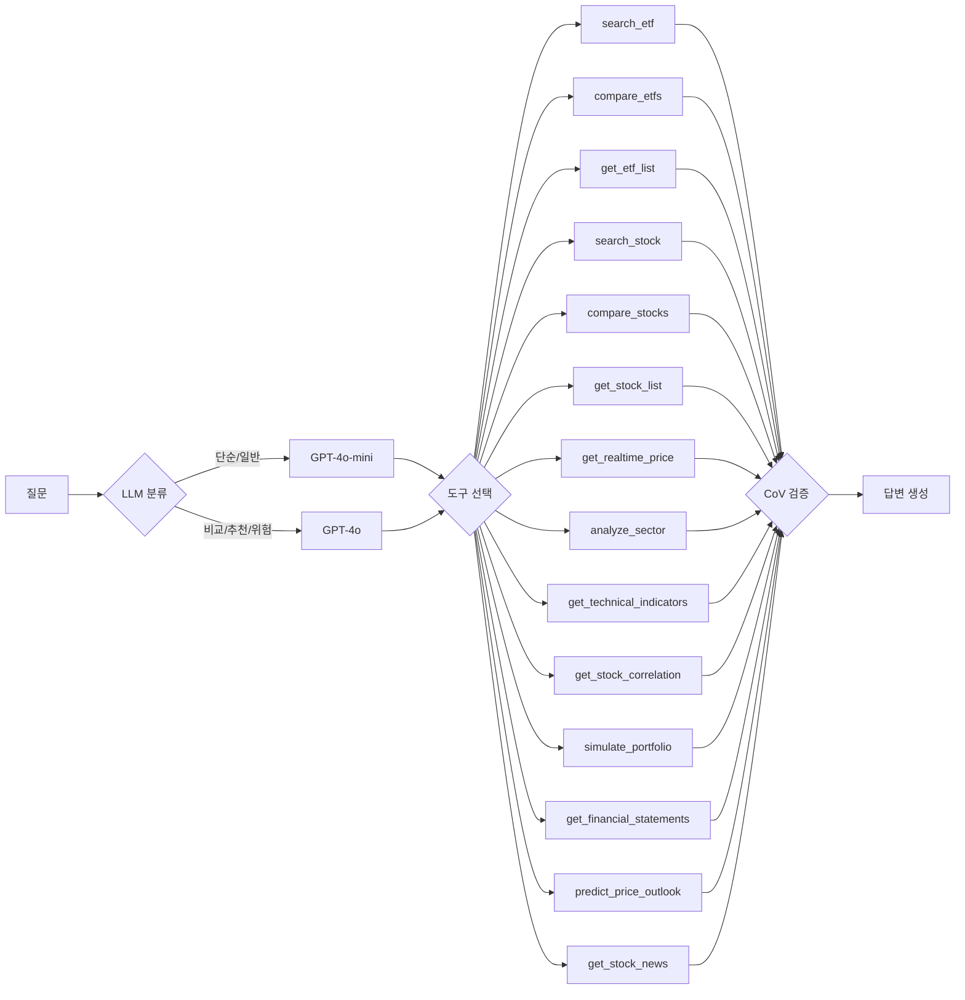

<div align="center">

# 📈 투자 질의응답 챗봇

### **[👉 SaaS 웹앱 (Next.js)](https://radiant-abundance-production-bdf0.up.railway.app)** · **[Streamlit 프로토타입](https://aiagent-5ejryv4fsnjvhrevzwn3ct.streamlit.app/)** — 별도 설치 없이 브라우저에서 바로 사용

**LangGraph Agent + Hybrid RAG 기반 ETF/주식 투자 정보 시스템**

KRX 전종목 ETF + 주식 데이터를 기반으로, AI 에이전트가 질문에 맞는 도구를 자동 선택하여 정확한 답변을 제공합니다.
**Streamlit 프로토타입 → FastAPI + Next.js SaaS 웹앱**으로 전환했습니다 (한국투자증권 실시간 시세 + 웹 푸시 알림 포함).

[](https://radiant-abundance-production-bdf0.up.railway.app)
[](https://aiagent-5ejryv4fsnjvhrevzwn3ct.streamlit.app/)
[](#)
[](https://github.com/m2222n/AI_agent/actions/workflows/ci.yml)
[](#)
[](#)
[](#)

[](#)
[](#)
[](#)
[](#)
[](#)
[](#)

</div>

---

## ChatGPT와 뭐가 다른가?

| | 이 챗봇 | ChatGPT |
|---|---|---|
| **데이터** | KRX 오늘 기준 (매일 18:30 자동 수집) | 학습 데이터 기준 (수개월 전) |
| **종목 커버리지** | ETF 1,088 + 주식 KOSPI/KOSDAQ 전종목 | 일부 유명 종목만 |
| **정확도** | 실제 종가/NAV/PER/수익률 기반 답변 | 추정 + 할루시네이션 위험 |
| **비교 분석** | 구조화 테이블 + 시계열 차트 자동 생성 | 텍스트만 |
| **장중 시세** | 한국투자증권 실시간 (REST 현재가/호가 + WebSocket 체결) → yfinance 15분 지연 fallback | 불가 |
| **보유종목 분석** | 역인덱스로 "삼성전자 담은 ETF" 즉시 답변 | 검색 불가 |
| **과거 데이터** | 12년 일별 데이터 (2014~2026, 800만 행) | 없음 |
| **기술적 분석** | 11개 지표 자동 분석 + matplotlib 차트 | 불가 |
| **재무제표** | OpenDart 분기 실적 (매출/영업이익/마진/YoY) | 불가 |
| **포트폴리오** | 백테스트 시뮬레이션 (수익률/MDD/샤프) + 벤치마크 비교 | 불가 |
| **가격 전망** | 4축 종합 분석 (기술적+펀더멘털+Ridge회귀+Prophet, Bootstrap CI) | 불가 |
| **뉴스 분석** | Google News 실시간 수집 + 감성 분석 (로컬 KR-FinBert-SC → GPT fallback) | 불가 |
| **알림** | 관심종목 급등/급락 웹 푸시 알림 (VAPID, 장 마감 후) | 불가 |

---

## 핵심 기능

### 🤖 LangGraph 에이전트 (14개 도구)



| 도구 | 기능 |
|------|------|
| `search_etf` | 하이브리드 RAG 검색 (FAISS + Kiwi BM25 + RRF + Cohere Rerank + MMR) |
| `compare_etfs` | ETF 비교 분석 (표/차트 자동 생성) |
| `get_etf_list` | 카테고리별 ETF 목록 검색 |
| `search_stock` | 주식 RAG 검색 |
| `compare_stocks` | 주식 비교 분석 (PER/PBR/시가총액/배당/재무제표) |
| `get_stock_list` | 키워드 기반 주식 목록 검색 |
| `get_realtime_price` | 장중 실시간 시세 (한국투자증권 KIS 우선 → yfinance → 장 외 종가 fallback) |
| `analyze_sector` | 종목→ETF 역인덱스 보유종목/섹터 분석 + 업종 밸류에이션 |
| `get_technical_indicators` | 기술적 지표 11개 (MA/RSI/MACD/볼린저/크로스/스토캐스틱/일목균형표/CCI/ADX/OBV/ATR) + 차트 이미지 |
| `get_stock_correlation` | 종목 간 상관관계 + 베타 계수 분석 |
| `simulate_portfolio` | 포트폴리오 백테스트 (수익률/MDD/샤프/변동성) + KODEX 200 벤치마크 비교 |
| `get_financial_statements` | 분기별 재무제표 (매출/영업이익/마진/YoY, OpenDart) |
| `predict_price_outlook` | 4축 가격 전망 (기술적+펀더멘털+Ridge회귀+Prophet, Bootstrap CI, 시나리오별 확률) |
| `get_stock_news` | 종목 뉴스 수집 + 감성 분석 (Google News RSS, 로컬 KR-FinBert-SC → GPT fallback, 긍정/부정/중립/혼재) |

### 🔍 하이브리드 검색 파이프라인

```
질문 입력
  │
  ├─ Step 0: ETF/주식 이름·티커 직접 매칭 (score=1.0)
  ├─ Step 1: FAISS Dense 검색 (벡터 유사도, k=20)
  ├─ Step 2: Kiwi BM25 Sparse 검색 (한국어 형태소, k=20)
  ├─ Step 3: RRF 결합 (dense 70% + sparse 30%)
  ├─ Step 4: Cohere Rerank v3.5 (cross-encoder 재정렬)
  ├─ Step 5: MMR 다양성 확보 (λ=0.7)
  └─ Step 6: 구조화 데이터 enrichment → 최종 답변
```

### 📊 탭 기반 UI (Streamlit 프로토타입 / Next.js SaaS 동일 6탭)

| 탭 | 기능 |
|----|------|
| **종합 채팅** | 자유 질문 + 스트리밍 답변 + 후속 질문 버튼 |
| **기술적 분석** | 종목 선택 → 11개 지표 + matplotlib 3단 차트 (기간 지정 가능: 6개월~10년) |
| **재무제표** | 종목 선택 → 분기별 매출/영업이익/마진/성장률 (2015년~) |
| **가격 전망** | 종목 선택 → 4축 종합 전망 (기술적+펀더멘털+Ridge+Prophet, 시나리오/확률/리스크) |
| **비교 분석** | 2종목 비교 → 구조화 테이블 + 시계열 차트 |
| **섹터 분석** | 업종별 등락률/시총 차트 + 업종 상세 종목 + 밸류에이션 요약 |

- **자동완성 검색**: ~4,200종목 이름/티커 검색 (`st.selectbox`)
- **후속 질문**: 1클릭 버튼 (`on_click` 콜백)
- **에러 재시도**: 실패 시 재질문 버튼
- **사이드바**: ETF/주식 종목 현황 + 기준일 + 업데이트 시간 안내

### 📈 데이터 파이프라인

- **자동 수집 (이중화 + Watchdog)**:
  - **GitHub Actions** — 매일 18:30 KST, deploy/ JSON + SQLite DB Release 갱신 → auto-commit → Streamlit Cloud 자동 재배포
  - **Watchdog** — 20:30 KST 수집 검증, 미실행 시 자동 재트리거 + GitHub Issue 알림
  - **macOS launchd** — 매일 18:30 로컬 SQLite DB 업데이트 + 19:00 DART 재무제표 백필
- **12년 과거 데이터**: 2014~2026, ETF+주식 전종목, 800만 행 (SQLite 1.5GB)
- **재무제표**: OpenDart API 전종목 147,048건 백필 완료 + 주간 자동 갱신
- **장중 시세**: yfinance 15분 지연, 5분 캐시

### 🛡️ 답변 품질 보장

- **CoV (Chain of Verification)**: 도구 사용 답변 자동 검증 (할루시네이션 방어)
- **Structured Output**: Pydantic 스키마 강제 (LLM 분류 JSON 보장)
- **force_answer**: 도구 2회 초과 호출 시 수집 증거 기반 강제 답변 생성
- **FAISS 디스크 캐싱**: MD5 해시 기반 캐시 무효화 (냉부팅 임베딩 절약)
- **BM25 pickle 캐싱**: 토크나이징 결과 pickle 직렬화 + MD5 해시 캐시 무효화

### 🚀 SaaS 전환 (Phase F) — FastAPI + Next.js

Streamlit 프로토타입을 **REST/SSE 백엔드 + Next.js 프론트엔드**로 전환해 Railway에 실배포했습니다.

- **백엔드 (`api/`, FastAPI)**: `/chat`·`/stream`(SSE 토큰 스트리밍) + 6개 데이터 탭 REST(`/tabs/*`) + JWT 이메일 인증 + 유저별 관심종목/대화이력 저장(동기 SQLAlchemy, Postgres/SQLite). 기존 LangGraph 에이전트를 Streamlit 없이 래핑.
- **프론트엔드 (`frontend/`, Next.js 16 + Tailwind v4)**: 채팅(SSE 실시간 타이핑·마크다운) + 6탭(기술/재무/비교/전망/섹터) + 로그인/관심종목 UI + 모바일 사이드바 드로워 + **설치형 PWA**.
- **한국투자증권 실시간 시세 (F-2)**: REST 현재가(`FHKST01010100`)·호가 10단계(`FHKST01010200`) + WebSocket 체결(`H0STCNT0`, 온디맨드 구독). 기술탭 PriceCard는 **WebSocket 우선 → REST 폴링 → 종가** fallback, OrderbookCard로 10단계 호가 표시.
- **웹 푸시 알림**: VAPID 구독 + Service Worker push 핸들러 + 관심종목 ±5% 급등/급락 일일 자동 발송(GitHub Actions 트리거).
- **로컬 감성 분석 (F-3)**: 뉴스 감성 분류를 로컬 `snunlp/KR-FinBert-SC`(선택적 설치)로 — 분류는 로컬, 요약은 GPT 하이브리드. 미설치 시 GPT fallback.

---

## 기술 스택

| 구분 | 기술 |
|------|------|
| **에이전트** | LangGraph + Function Calling (14개 도구) + 모델 라우팅 + CoV 검증 |
| **LLM** | GPT-4o (복잡 질문) + GPT-4o-mini (단순 질문) + Structured Output |
| **임베딩** | OpenAI text-embedding-3-small + FAISS persist (MD5 캐시) |
| **Vector DB** | FAISS (인메모리, 디스크 캐싱) + Pinecone (서버리스, 자동 fallback) |
| **검색** | Kiwi BM25 + FAISS Dense + RRF + Cohere Rerank v3.5 + MMR + 이름/접두어/별칭 매칭 |
| **데이터** | pykrx (ETF 1,088 + 주식 전종목) + 한국투자증권 KIS OpenAPI (REST 현재가/호가 + WebSocket 체결) + yfinance (15분 지연 fallback) + dart-fss (재무제표) |
| **저장** | SQLite WAL (12년 보존, 1.5GB, 800만 행) + JSON fallback / 유저 DB(Postgres·SQLite, SQLAlchemy) |
| **분석** | 기술적 지표 11개 + 상관관계/베타 + 포트폴리오 백테스트 + Ridge 회귀 + Prophet 시계열 전망 |
| **차트** | matplotlib (기술적 분석 3단 + 비교 시계열, base64 PNG) |
| **예측** | scikit-learn Ridge 회귀 + Facebook Prophet + Bootstrap CI + 4축 종합 (기술적+펀더멘털+통계+Prophet) |
| **뉴스/감성** | Google News RSS + 로컬 KR-FinBert-SC (선택적) → GPT-4o-mini fallback (긍정/부정/중립/혼재) |
| **백엔드 (SaaS)** | FastAPI (`/chat`·`/stream` SSE + `/tabs/*` REST) + JWT 인증 + 동기 SQLAlchemy + 웹 푸시(pywebpush/VAPID) |
| **프론트엔드 (SaaS)** | Next.js 16 + Tailwind v4 (SSE 스트리밍, 6탭, 로그인/관심종목, 모바일 드로워, 설치형 PWA) |
| **평가** | RAGAS (Hit Rate 100%, F 0.688, AR 0.709, CR 0.854, 172개 데이터셋) |
| **테스트** | pytest 766개 (단위 + E2E 통합 + API/인증/푸시/KIS) |
| **자동 수집** | GitHub Actions (deploy/ + DB Release + 푸시 알림 트리거) + Watchdog (자동 재트리거) + macOS launchd |
| **모니터링** | LangSmith (free tier) |
| **UI** | Streamlit (프로토타입) + Next.js (SaaS) — 탭 UI, 자동완성, 후속질문, 반응형 |
| **배포** | Railway (FastAPI 백엔드 + Next.js 프론트, 2서비스) + Streamlit Cloud (프로토타입) |

**월 비용**: $5~17 (OpenAI API) + Railway 무료 티어 / Hobby $5~ (개인 프로젝트). KIS 실시간·로컬 감성은 추가 비용 0.

---

## 평가 결과

### 검색 품질 (Hit Rate)
```
평가 데이터셋: 172개 질문 (8개 유형)
├── simple, compare, recommend, risk, general,
│   technical, correlation, portfolio
├── ETF / 주식 / 혼합 전 유형
└── 전체 Hit Rate:     100.0% (172/172)
```

**Hit Rate 개선 과정**: 45% → 75% (이름 매칭) → 88% (에이전트) → 91.9% (도구 확장) → 95.2% (프롬프트) → **100%** (접두어/별칭 매칭)

### RAGAS 답변 품질
| 지표 | 값 | 개선 |
|------|-----|------|
| Hit Rate | 100% (172/172) | — |
| Faithfulness | **0.688** | +0.188 |
| Answer Relevancy | **0.709** | +0.286 |
| Context Recall | **0.854** | +0.518 |

**개선 방법**: 컨텍스트 조립 강화 (도구 결과 5000자, 비교 테이블 텍스트화) + 프롬프트 수치 인용 강제 + AR 한국어 역질문 프롬프트 커스텀 (strictness 5) + ground_truth 44개 보정

---

## 프로젝트 구조

```
ETF_RAG/
├── app.py                     # Streamlit 진입점 (프로토타입)
├── config.py                  # 설정/상수 관리 (KIS / VAPID / SENTIMENT 등)
├── api/                       # SaaS 백엔드 (FastAPI)
│   ├── main.py                # /chat·/stream(SSE)·/health·/feedback·/stats
│   ├── tabs.py                # 6탭 REST + /tabs/price·orderbook·price/stream(SSE)
│   ├── auth.py                # JWT 이메일 인증
│   ├── user_data.py           # 유저별 관심종목/대화이력 CRUD
│   ├── push.py                # 웹 푸시 (VAPID 구독 + 관심종목 일일 알림)
│   ├── db.py / models_db.py   # 동기 SQLAlchemy (User/Watchlist/ChatHistory/PushSubscription)
│   └── models.py / deps.py    # Pydantic 모델 + init 의존성
├── frontend/                  # SaaS 프론트엔드 (Next.js 16 + Tailwind v4)
│   └── src/                   # 채팅(SSE) + 6탭 + 로그인/관심종목 + PriceCard/OrderbookCard + PushToggle + PWA
├── src/
│   ├── data/
│   │   ├── loader.py          # 데이터 로딩 (SQLite→JSON→fallback)
│   │   ├── database/          # SQLite CRUD 패키지 (5 서브모듈, WAL, 8 테이블)
│   │   ├── collector.py       # ETF 일배치 수집 (pykrx)
│   │   ├── stock_collector.py # 주식 일배치 수집
│   │   ├── dart_collector.py  # OpenDart 재무제표 수집 (dart-fss)
│   │   ├── realtime.py        # 장중 시세 (KIS 우선 → yfinance fallback)
│   │   ├── kis_client.py      # 한국투자증권 REST (현재가 FHKST01010100 / 호가 FHKST01010200, OAuth 토큰 캐시)
│   │   ├── kis_ws.py          # 한국투자증권 WebSocket 실시간 체결 (H0STCNT0 온디맨드 구독, refcount)
│   │   ├── technical/         # 기술적 지표 패키지 (5 서브모듈, 11개 지표)
│   │   ├── chart_generator/   # matplotlib 차트 패키지 (5 서브모듈, 8종 차트)
│   │   ├── predictor.py       # 4축 가격 전망 (기술적+펀더멘털+Ridge회귀+Prophet, Bootstrap CI)
│   │   ├── news.py            # Google News RSS + 감성 분석 (로컬 → GPT fallback)
│   │   ├── sentiment.py       # 로컬 금융 감성 분류 (KR-FinBert-SC 선택적, 미설치 시 None→GPT)
│   │   └── db_downloader.py   # GitHub Release DB 다운로드 (Streamlit Cloud용)
│   ├── rag/
│   │   ├── retriever.py       # HybridRetriever (FAISS+BM25+RRF+MMR+이름매칭, BM25 pickle 캐시)
│   │   └── vectorstore.py     # FAISS/Pinecone 벡터스토어 (persist + MD5 캐시 + 자동 fallback)
│   ├── llm/
│   │   ├── agent.py           # LangGraph 에이전트 (라우팅+도구+재검색+CoV+force_answer)
│   │   ├── tools/             # Function Calling 도구 패키지 (7 서브모듈, 14개 도구)
│   │   ├── prompts.py         # 유형별 시스템 프롬프트
│   │   └── classifier.py      # 질문 분류 (Structured Output + 키워드 fallback)
│   └── ui/
│       ├── chat.py            # 스트리밍 채팅 + 후속질문 on_click 콜백
│       ├── charts.py          # 구조화 데이터 렌더링 (비교 테이블 + 기술적 차트)
│       ├── tabs.py            # 탭별 전용 UI (6개 탭, selectbox 자동완성)
│       ├── sidebar.py         # 사이드바 (데이터 현황)
│       └── styles.py          # 커스텀 CSS
├── eval/                      # RAGAS 평가 (172개 질문, 8개 유형)
├── tests/                     # pytest 766개 (단위 + E2E + API/인증/푸시/KIS)
├── scripts/
│   ├── daily_collect.sh                # ETF+주식+DART 일배치 수집
│   ├── collect_for_deploy.py           # GitHub Actions용 경량 수집
│   ├── backfill_historical.py          # 12년 과거 데이터 백필
│   ├── backfill_financials_runner.py   # DART 전종목 재무제표 백필
│   ├── backfill_yfinance.py            # yfinance KRX 윈도우 밖 백필
│   ├── verify_and_recover.py           # 수집 검증 + 누락 자동 보충
│   ├── com.etfrag.daily-collect.plist  # launchd 스케줄 (18:30)
│   └── com.etfrag.dart-backfill.plist  # launchd 스케줄 (19:00, DART)
├── .gitignore                      # Python/SQLite/IDE/OS 파일 제외
└── .github/workflows/
    ├── daily-collect.yml               # GitHub Actions (18:30 KST, deploy/ + DB Release + 실패 Issue)
    ├── ci.yml                          # CI (PR/push 시 pytest + coverage)
    └── watchdog-collect.yml            # 수집 Watchdog (20:30 KST, 자동 재트리거 + Issue 알림)
```

---

## 실행 방법

### 1. 설치

```bash
git clone https://github.com/m2222n/AI_agent.git
cd AI_agent/ETF_RAG
pip install -r requirements.txt
```

### 2. 환경 변수

```bash
cp .env.example .env
# .env 파일에 OPENAI_API_KEY, DART_API_KEY 설정
```

### 3. 데이터 수집 (선택)

```bash
# ETF 수집
python -m src.data.collector

# 주식 수집
python -m src.data.stock_collector

# 재무제표 수집 (OpenDart)
python -m src.data.dart_collector

# 12년 과거 데이터 백필
python scripts/backfill_historical.py --resume
```

### 4. 실행

```bash
# 프로토타입 (Streamlit)
streamlit run app.py

# SaaS 백엔드 (FastAPI) — repo 루트가 ETF_RAG 기준
uvicorn api.main:app --port 8000

# SaaS 프론트엔드 (Next.js) — 별도 터미널
cd frontend && npm install && npm run dev   # NEXT_PUBLIC_API_BASE=http://localhost:8000
```

### 5. 테스트

```bash
pytest tests/ -v
```

> 선택: `transformers`/`torch` 설치 시 뉴스 감성을 로컬 KR-FinBert-SC로 분류(비용 0), 미설치 시 GPT fallback.
> 선택: KIS 실시간(`KIS_*`)·웹 푸시(`VAPID_*`, `scripts/gen_vapid_keys.py`)는 `.env`에 키 설정 시 활성화.

---

## 로드맵

- [x] **Phase 0**: 프로젝트 구조 리셋 (모듈 분리)
- [x] **Phase 1**: pykrx 데이터 수집 + SQLite DB + 주식 확장 + 12년 백필 + 자동화 (launchd + GitHub Actions)
- [x] **Phase 2**: 하이브리드 검색 (FAISS + BM25 + RRF + MMR) + RAGAS 평가
- [x] **Phase 3**: LangGraph 에이전트 + 도구 + 모델 라우팅 + 프롬프트 개선
- [x] **Phase 4**: UI/UX 개편 + 탭 분리 + 자동완성 + 실시간 시세 + 섹터 분석
- [x] **Phase C**: 정량 분석 — 기술적 지표 + 상관관계/베타 + 포트폴리오 시뮬레이션 + 재무제표 (OpenDart)
- [x] **Phase D**: 기술적 지표 확장 (11개) + matplotlib 차트 + 가격 전망 모델 (4축: Ridge회귀+Prophet)
- [x] **품질 강화**: CoV 검증 + Structured Output + FAISS persist + force_answer + Bootstrap CI
- [x] **안정성 + 모바일**: 수집 Watchdog (자동 재트리거) + 반응형 CSS (태블릿/모바일 대응)
- [x] **Phase E-1**: 답변 품질 + UX — 멀티 도구 병렬 호출, 대화 맥락 유지, 섹션 접기/펼치기, 동적 예시 질문
- [x] **Phase E-2**: 검색 + 평가 고도화 — Cohere Rerank v3.5, E2E 통합 테스트 42개, RAGAS 답변 품질 재개선 (F 0.688, AR 0.709, CR 0.854)
- [x] **Phase E-3**: 차트 시각화 + 섹터 탭 — 포트폴리오/재무/밸류에이션/장중/섹터 차트, 관심종목, 속도 최적화
- [x] **Phase E-4**: BM25 pickle 캐싱 + 뉴스 감성 분석 + Prophet 시계열 예측 + Pinecone 벡터 DB
- [x] 코드 리팩토링: 4개 대형 모듈 → 패키지 분리 (~4,170줄 → 22 서브모듈, 100% 역호환)
- [x] 코드 리뷰 6건 수정 + CI 파이프라인 (PR/push 자동 테스트) + .gitignore
- [x] 방문자 카운터 (Supabase REST API, 일별+누적) + 수집 버그 수정
- [x] Hit Rate 100% (172개 eval) + RAGAS 답변 품질 대폭 개선 (F=0.688, AR=0.709, CR=0.854)
- [x] **Phase F: SaaS 전환** — FastAPI 백엔드(`/chat`·`/stream`·`/tabs/*` + JWT 인증 + 유저 저장) + Next.js 16 프론트(6탭 + 로그인/관심종목 + PWA) + **Railway 실배포**
- [x] **F-2: 한국투자증권 실시간 시세** — REST 현재가/호가(10단계) + WebSocket 체결(온디맨드 구독), yfinance/종가 fallback
- [x] **웹 푸시 알림** — VAPID 구독 + Service Worker + 관심종목 ±5% 급등/급락 일일 자동 발송
- [x] **F-3: 로컬 감성 분석** — 뉴스 감성을 로컬 KR-FinBert-SC(선택적) → GPT fallback 하이브리드
- [ ] 한국어 임베딩 비교 (BGE-M3) / 유료 구독 전환
- [ ] **Phase G: 모바일 앱** — React Native (웹 코드 70% 재사용), 네이티브 푸시, 오프라인 캐시

---

<div align="center">

**개인 프로젝트** | 정태민 ([@m2222n](https://github.com/m2222n))

</div>
