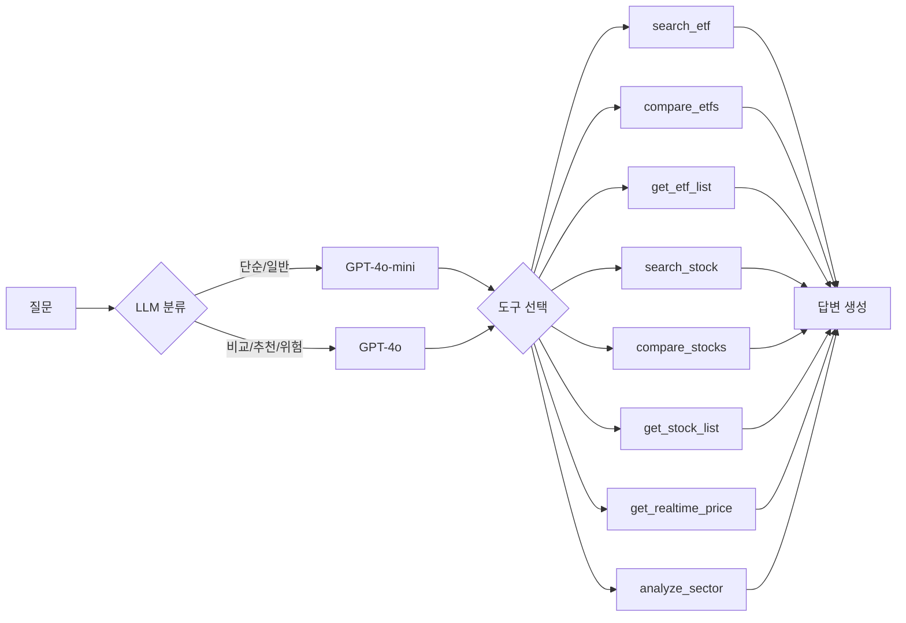

<div align="center">

# 📈 투자 질의응답 챗봇

**LangGraph Agent + Hybrid RAG 기반 ETF/주식 투자 정보 시스템**

KRX 전종목 ETF + 주식 데이터를 기반으로, AI 에이전트가 질문에 맞는 도구를 자동 선택하여 정확한 답변을 제공합니다.

[](https://aiagent-5ejryv4fsnjvhrevzwn3ct.streamlit.app/)
[](#)
[](#)
[](#)

</div>

---

## ChatGPT와 뭐가 다른가?

| | 이 챗봇 | ChatGPT |
|---|---|---|
| **데이터** | KRX 오늘 기준 (매일 18:00 자동 수집) | 학습 데이터 기준 (수개월 전) |
| **종목 커버리지** | ETF 1,088 + 주식 KOSPI/KOSDAQ 전종목 | 일부 유명 종목만 |
| **정확도** | 실제 종가/NAV/PER/수익률 기반 답변 | 추정 + 할루시네이션 위험 |
| **비교 분석** | 구조화 테이블 + 차트 자동 생성 | 텍스트만 |
| **장중 시세** | yfinance 15분 지연 실시간 (장중) | 불가 |
| **보유종목 분석** | 역인덱스로 "삼성전자 담은 ETF" 즉시 답변 | 검색 불가 |
| **과거 데이터** | 3년 일별 데이터 (2023~2026) | 없음 |

---

## 핵심 기능

### 🤖 LangGraph 에이전트 (8개 도구)



| 도구 | 기능 |
|------|------|
| `search_etf` | 하이브리드 RAG 검색 (FAISS + Kiwi BM25 + RRF + MMR) |
| `compare_etfs` | ETF 비교 분석 (표/차트 자동 생성) |
| `get_etf_list` | 카테고리별 ETF 목록 검색 |
| `search_stock` | 주식 RAG 검색 |
| `compare_stocks` | 주식 비교 분석 (PER/PBR/시가총액/배당) |
| `get_stock_list` | 키워드 기반 주식 목록 검색 |
| `get_realtime_price` | 장중 실시간 시세 (yfinance) + 장 외 종가 fallback |
| `analyze_sector` | 종목→ETF 역인덱스 보유종목/섹터 분석 |

### 🔍 하이브리드 검색 파이프라인

```
질문 입력
  │
  ├─ Step 0: ETF/주식 이름·티커 직접 매칭 (score=1.0)
  ├─ Step 1: FAISS Dense 검색 (벡터 유사도, k=20)
  ├─ Step 2: Kiwi BM25 Sparse 검색 (한국어 형태소, k=20)
  ├─ Step 3: RRF 결합 (dense 70% + sparse 30%)
  ├─ Step 4: MMR 다양성 확보 (λ=0.7)
  └─ Step 5: 구조화 데이터 enrichment → 최종 답변
```

### 📊 데이터 파이프라인

- **일배치 수집**: pykrx → ETF 시세/NAV/수익률/보유종목 + 주식 OHLCV/시총/PER/PBR/배당
- **3년 과거 데이터**: 728 영업일, ETF 608K + Stock 2M 레코드 (SQLite)
- **자동화**: macOS launchd 매일 18:00 자동 실행
- **장중 시세**: yfinance 15분 지연, 5분 캐시

---

## 기술 스택

| 구분 | 기술 |
|------|------|
| **에이전트** | LangGraph + Function Calling (8개 도구) + 모델 라우팅 |
| **LLM** | GPT-4o (복잡 질문) + GPT-4o-mini (단순 질문) |
| **임베딩** | OpenAI text-embedding-3-small |
| **Vector DB** | FAISS (인메모리) |
| **검색** | Kiwi BM25 + FAISS Dense + RRF + MMR + 이름 매칭 |
| **데이터** | pykrx (ETF 1,088 + 주식 전종목) + yfinance (장중) |
| **저장** | SQLite WAL (3년 보존) + JSON fallback |
| **평가** | RAGAS (Hit Rate 91.9%, 75개 데이터셋) |
| **테스트** | pytest 206개 |
| **모니터링** | LangSmith (free tier) |
| **UI** | Streamlit (커스텀 CSS, 반응형) |
| **배포** | Streamlit Cloud |

**월 비용**: $5~17 (OpenAI API 기준, 개인 프로젝트)

---

## 평가 결과

### 검색 품질 (Hit Rate)
```
평가 데이터셋: 75개 질문 (ETF 50 + 주식 22 + 혼합 3)
├── simple (32개):    93.8%
├── compare (13개):   92.3%
├── recommend (18개): 94.4%
├── risk (5개):       80.0%
├── general (6개):    83.3%
├── ETF:             88.0%
├── 주식:            100%
├── 혼합:            100%
└── 전체 Hit Rate:   91.9%
```

### RAGAS 답변 품질
| 지표 | 값 |
|------|-----|
| Faithfulness | 0.549 |
| Faithfulness (RAG only) | 0.578 |
| Answer Relevancy | 0.340 |
| Context Recall | 0.469 |

---

## 프로젝트 구조

```
ETF_RAG/
├── app.py                     # Streamlit 진입점
├── config.py                  # 설정/상수 관리
├── src/
│   ├── data/
│   │   ├── loader.py          # 데이터 로딩 (SQLite→JSON→fallback)
│   │   ├── database.py        # SQLite CRUD (WAL, 6 테이블)
│   │   ├── collector.py       # ETF 일배치 수집 (pykrx)
│   │   ├── stock_collector.py # 주식 일배치 수집
│   │   └── realtime.py        # 장중 시세 (yfinance)
│   ├── rag/
│   │   ├── retriever.py       # HybridRetriever (FAISS+BM25+RRF+MMR)
│   │   └── vectorstore.py     # FAISS 벡터스토어
│   ├── llm/
│   │   ├── agent.py           # LangGraph 에이전트 (라우팅+도구+재검색)
│   │   ├── tools.py           # Function Calling 도구 8개
│   │   ├── prompts.py         # 유형별 시스템 프롬프트
│   │   └── classifier.py      # 질문 분류 (LLM + 키워드 fallback)
│   └── ui/
│       ├── chat.py            # 스트리밍 채팅 처리
│       ├── charts.py          # 비교 테이블/차트 렌더링
│       ├── sidebar.py         # 사이드바 (데이터 현황)
│       └── styles.py          # 커스텀 CSS
├── eval/                      # RAGAS 평가 (75개 질문)
├── tests/                     # pytest 206개
└── scripts/                   # 백필 + 일배치 자동화 (launchd)
```

---

## 실행 방법

### 1. 설치

```bash
git clone https://github.com/m2222n/AI_agent.git
cd AI_agent/ETF_RAG
pip install -r requirements.txt
```

### 2. 환경 변수

```bash
cp .env.example .env
# .env 파일에 OPENAI_API_KEY 설정
```

### 3. 데이터 수집 (선택)

```bash
# ETF 수집
python -m src.data.collector

# 주식 수집
python -m src.data.stock_collector

# 과거 3년 백필
python scripts/backfill_historical.py --resume
```

### 4. 실행

```bash
streamlit run app.py
```

### 5. 테스트

```bash
pytest tests/ -v
```

---

## 로드맵

- [x] **Phase 0**: 프로젝트 구조 리셋 (모듈 분리)
- [x] **Phase 1**: pykrx 데이터 수집 + SQLite DB + 주식 확장 + launchd 자동화
- [x] **Phase 2**: 하이브리드 검색 (FAISS + BM25 + RRF + MMR) + RAGAS 평가
- [x] **Phase 3**: LangGraph 에이전트 + 8개 도구 + 모델 라우팅 + 프롬프트 개선
- [x] **Phase 4**: UI/UX 개편 + 에러 핸들링 + 실시간 시세 + 섹터 분석
- [ ] **추후**: Pinecone + Cohere Rerank + KIS OpenAPI + 포트폴리오 시뮬레이션

---

<div align="center">

**개인 프로젝트** | 정태민 ([@m2222n](https://github.com/m2222n))

</div>
